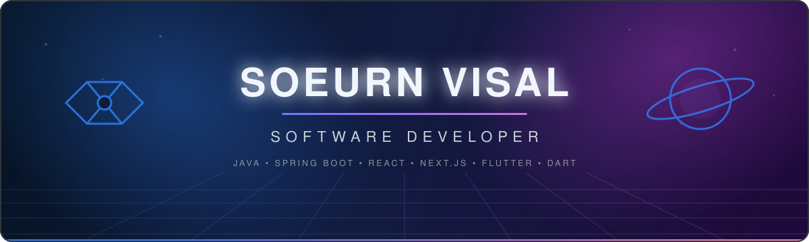

### Connect with me 👋

## About me 

- 👨‍💻 I'm a **Software Developer** who loves turning complex problems into simple, beautiful solutions.
- 🌱 I'm constantly learning **Advanced Microservices**.
- 💬 Ask me about **Java, Spring Boot, React, and Next.js**.
- 📫 Reach me at **[visalsoeurn9@gmail.com](mailto:visalsoeurn9@gmail.com)**.

> **“Learn more, Earn less, keep going until UP.”**

## Tech stack 🛠️

<b>Frontend</b>

 

<b>Backend</b>

 

<b>Databases</b>

 

<b>DevOps & tools</b>

 

<b>Version control</b>

 

## GitHub stats 📊

<picture>
  <source media="(prefers-color-scheme: dark)" srcset="https://github-profile-summary-cards.vercel.app/api/cards/stats?username=see-visal&theme=github_dark" />
  <source media="(prefers-color-scheme: light)" srcset="https://github-profile-summary-cards.vercel.app/api/cards/stats?username=see-visal&theme=github" />
  
</picture>
<picture>
  <source media="(prefers-color-scheme: dark)" srcset="https://github-profile-summary-cards.vercel.app/api/cards/repos-per-language?username=see-visal&theme=github_dark" />
  <source media="(prefers-color-scheme: light)" srcset="https://github-profile-summary-cards.vercel.app/api/cards/repos-per-language?username=see-visal&theme=github" />
  
</picture>

<picture>
  <source media="(prefers-color-scheme: dark)" srcset="https://github-readme-activity-graph.vercel.app/graph?username=see-visal&bg_color=0d1117&color=c9d1d9&line=58a6ff&point=bc8cff&area=true&hide_border=true" />
  <source media="(prefers-color-scheme: light)" srcset="https://github-readme-activity-graph.vercel.app/graph?username=see-visal&bg_color=ffffff&color=1f2328&line=0969da&point=8250df&area=true&hide_border=true" />
  
</picture>

